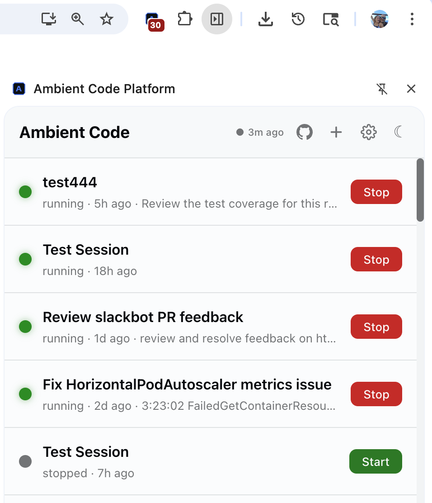
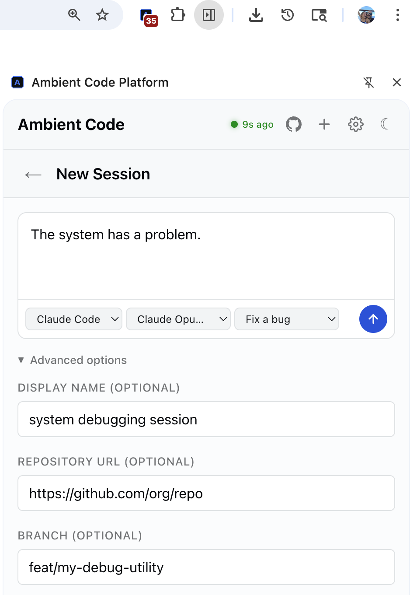
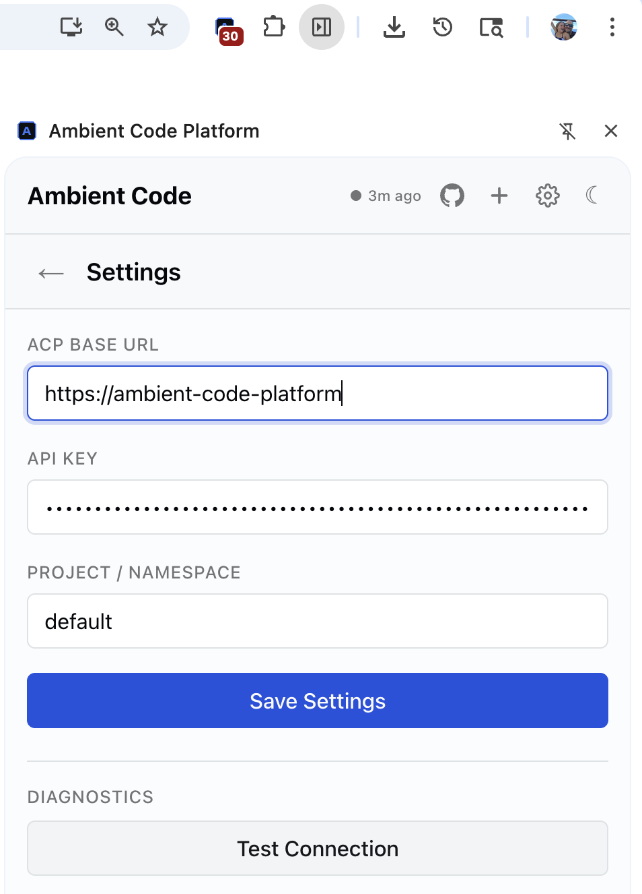

# ACP Browser Extension

Chrome extension for monitoring and interacting with [Ambient Code Platform](https://github.com/ambient-code) agentic sessions from your browser.

- **Guided setup wizard** — connect with just a URL and API key, then select or create a workspace
- **Workspace management** — create, switch, and delete workspaces from the extension
- View and manage running sessions
- Chat with agents in real time (streaming via SSE)
- Create new sessions with workflow and model selection
- Get notified when an agent needs input or finishes a run

## Screenshots

<p align="center">
  
  
  
</p>

## Quickstart

1. Clone the repo:
   ```bash
   git clone https://github.com/ambient-code/browser-extension.git
   ```

2. Open Chrome and navigate to `chrome://extensions`

3. Enable **Developer mode** (toggle in the top-right corner)

4. Click **Load unpacked** and select the cloned `browser-extension` directory

5. Click the extension icon in the toolbar, then open the **side panel**

6. The **setup wizard** will guide you through connecting:
   - Enter your **ACP Base URL** (e.g. `https://acp.example.com`)
   - Enter your **API Key**
   - Click **Connect** — the extension validates your credentials
   - Select an existing workspace or create a new one

7. Start managing your sessions

To switch workspaces later, open **Settings** and use the workspace dropdown. You can also create and delete workspaces from Settings.

## Development

No build step required. Edit files and reload the extension in `chrome://extensions`.

## Contributing

Contributions are welcome. Please open an issue or pull request on GitHub.

## License

Apache-2.0
